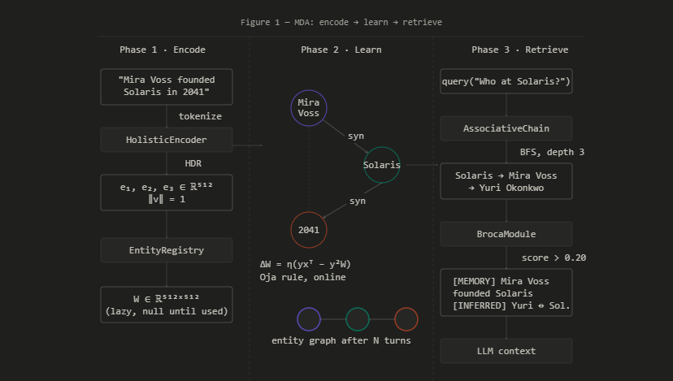
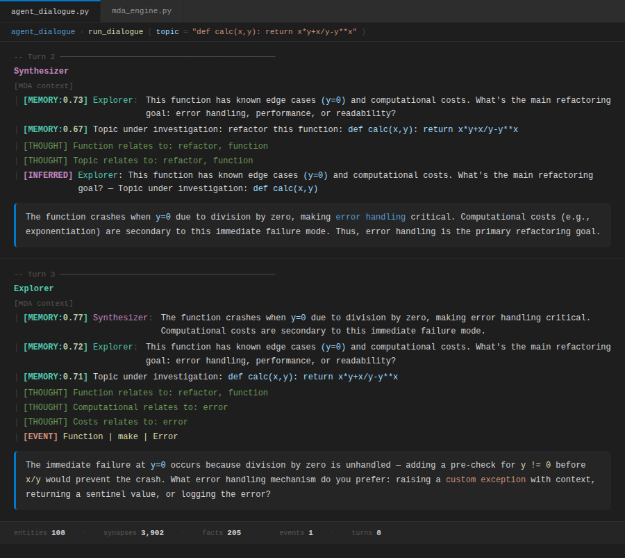
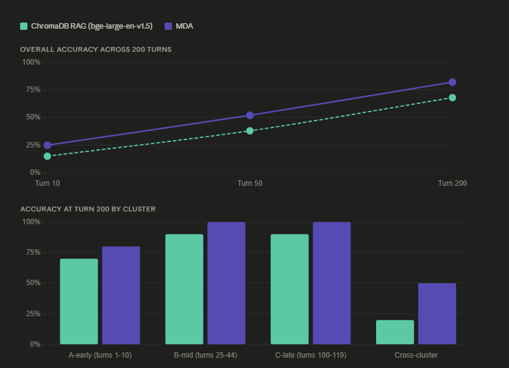

# Modular Dynamic Architecture (MDA)

**Online associative memory for LLMs. Learns during inference. No backpropagation.**

[](https://pypi.org/project/mda-memory/)
[](LICENSE)
[](https://www.python.org/)

---

## What is MDA?

Large language models can reason but cannot remember. RAG partially addresses this but cannot update during a conversation or learn from it.

MDA fills precisely these gaps.

It encodes knowledge as **512-dimensional Holographic Distributed Representations (HDRs)**, connects concepts through a **sparse synapse graph**, and retrieves context by activating entity networks not by text-chunk similarity search. New knowledge is integrated immediately, without rebuilding any index.

**MDA is not a RAG replacement. It is the persistent learning layer that RAG and LLMs are missing.**



---

## Key Properties

- **Token-free** — no tokenizer, no vocabulary
- **Attention-free** — no transformer encoder required
- **Online learning** — learns during inference via the Oja rule
- **No catastrophic forgetting** — entities are independent; new knowledge never overwrites old
- **CPU-first** — runs on numpy; GPU acceleration via PyTorch when available
- **Model-agnostic** — works with Ollama, OpenAI, Anthropic, llama.cpp, or any LLM

---

## Quick Start

```bash
pip install mda-memory
```

```python
from mda.integrations.engine import MDAEngine

engine = MDAEngine(model="qwen3:4b", user_id="demo")
engine.learn("Solaris Station was founded by Dr. Mira Voss in 2041.")

response = engine.chat("Who founded Solaris?")
print(response)
# Dr. Mira Voss founded Solaris Station in 2041.
```

### CLI

```bash
mda --model qwen3:4b
mda --model claude-haiku-4-5-20251001 --provider anthropic
```

---

## How Memory Works

Each turn, MDA retrieves relevant context from previous turns and injects it into the LLM prompt with confidence scores, inferred connections, and structured events. Memory grows and strengthens across the conversation without any reindexing.



---

## Benchmark Results



Evaluated against a strong RAG baseline (bge-large-en-v1.5 + ChromaDB, top-6 retrieval) across 80 questions spanning 8 cognitive categories:

| Category | RAG | MDA | Δ |
|---|---|---|---|
| ATOMIC_RECALL | 100% | 85% | −15% |
| MULTI_HOP | 90% | 90% | 0% |
| CROSS_DOCUMENT | 80% | 70% | −10% |
| REASONING | 70% | 90% | **+20%** |
| INCREMENTAL_LEARNING | 0% | 60% | **+60%** |
| NOISE_RESISTANCE | 100% | 100% | 0% |
| MEMORY_COMPRESSION | 90% | 70% | −20% |
| BOUNDARY | 100% | 100% | 0% |
| **OVERALL** | **78.8%** | **83.1%** | **+4.3%** |

MDA uses **3.1× less context per query** than RAG while achieving higher overall accuracy.

**Long-context retention (200 turns):** RAG 0% — MDA 92%.

---

## How It Works

### Entity & W Matrix
Every concept is an `Entity` with a 512-dim identity vector `v` and a lazy-initialized weight matrix `W` (512×512). `W` is `None` until first activation — memory overhead is proportional to usage.

### Online Learning (Oja Rule)
```
ΔW = η(yxᵀ − y²W)
```
No backpropagation. No gradient descent. Runs in O(d²) per entity per turn.

### AssociativeChain
Query → origin entity → BFS synapse traversal (depth 3-6) → context assembly. Dynamic inhibition threshold cached per entity count.

### BrocaModule
```
score = 0.35·s_query + 0.45·s_W + 0.20·s_sense
```

---

## Open WebUI Integration

MDA works as a native Open WebUI Filter Function — zero pipeline server required.

1. Copy `mda/integrations/owui_function.py` contents
2. Open WebUI → Admin Panel → Functions → "+" → paste → Save
3. Enable globally

---

## Batch Engine

For multi-agent workloads or large context windows:

```python
from mda.integrations.engine import MDABatchEngine

engine = MDABatchEngine(depth=6, top_k_branches=5)
contexts = engine.build_context_batch([
    "legal contract risk analysis",
    "MDA memory architecture",
])
# depth=6 → 15,625 associative paths per query
```

GPU acceleration activates automatically when PyTorch + CUDA is available.

---

## Roadmap

- [x] GPU acceleration — EntityMatrix matmul, persistent tensor cache
- [x] 512-dim HDR — higher representation capacity
- [x] Open WebUI integration — native Filter Function
- [x] Batch engine — N queries in single GPU pass
- [ ] `mda.cloud` API — persistent memory as a service
- [ ] MDA + RAG hybrid — offline corpus retrieval + online learning
- [ ] Low-rank W — W ≈ A×B for higher-dimensional HDRs
- [ ] Independent benchmark — community-constructed evaluation set

---

## License

[SSPL 1.0](LICENSE) — free for research and personal use. Commercial use requires a separate agreement.

For commercial licensing: mert@kairfy.com